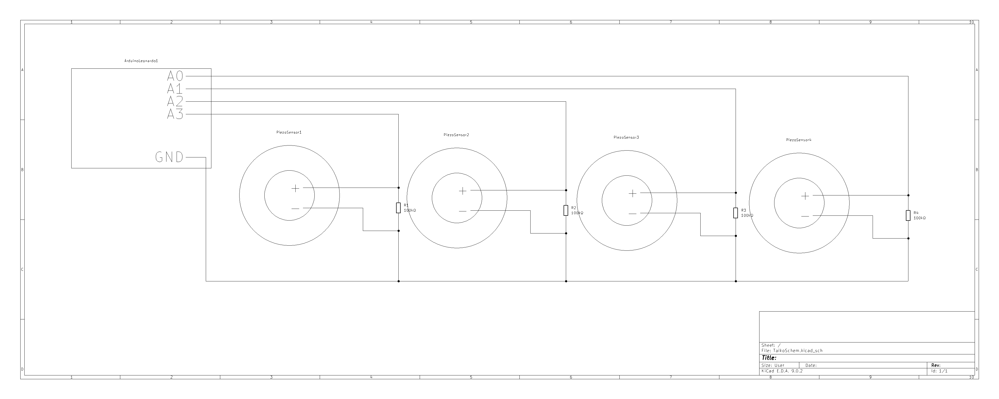
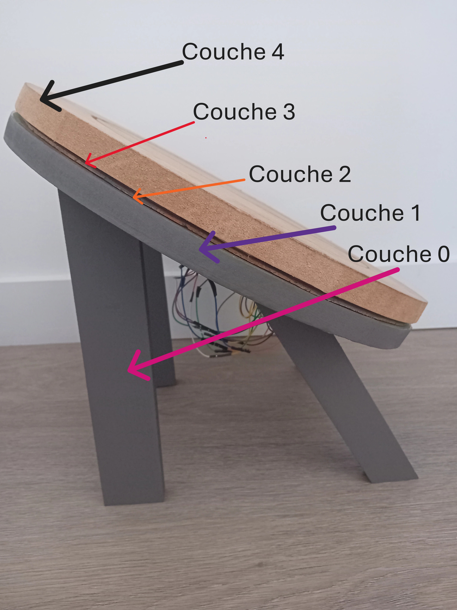
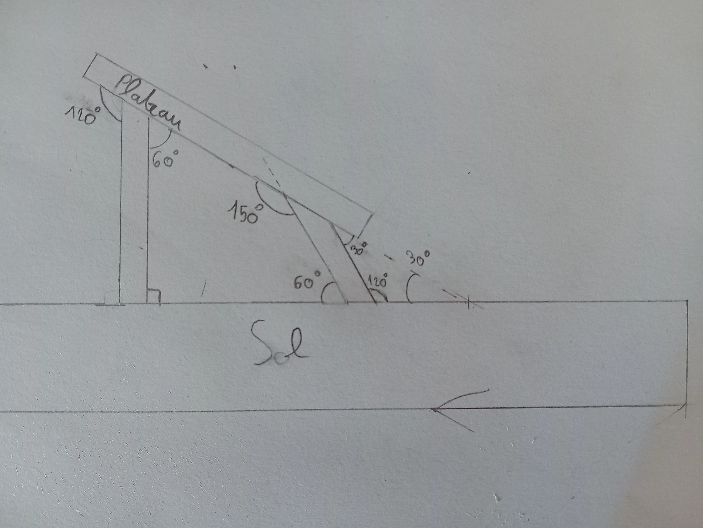
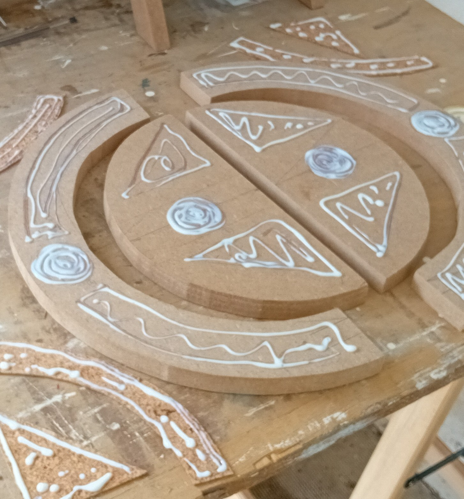

## A propos du projet

Ce projet est la construction d'un tambour de type Taiko Force Lvl 5 pour les jeux de rythme du style Taiko.

## Pieces requises

1. Une carte programmable type Arduino Leonardo (ATmega32U4)
      Il existe surement des meilleurs processeurs que le ATmega32U4 pour cette utilisation mais il faut bien verifier avant d'acheter que la carte et/ou le processeur de la carte peut émuler un clavier (et donc qu'elle est compatible avec la library "keyboard.h")

2. 4 Capteurs Piezoéléctriques (Pour moi c'était des pastilles de 5cm de diamètre)
   
3. 4 resistances pour éviter que les capteurs piezo endomagent la carte (J'ai mis du 100kΩ mais la valeur peut être changée).
   
4. Des composants de base type cable, breadboard, multimètre, soudure, cutter, colle...

5. Une armature physique, voir après pour une description détaillée (Il est largement possible de changer la forme du tambour)

## Partie Electronique et Code

Voici le schéma éléctrique pour n'importe quel tambour : 
   Ps : J'ai volontairement éclipsé les autres pin de la carte Arduino étant donné qu'il ne sont pas utiles à ce projets mais cela ne veut pas dire que la carte ne possède que les pin affiché sur le schéma...

Pour le code j'avais moi même fait un truc qui s'est révélé être horriblement lent, donc je suis allé m'inspirer d'un code déja existant qu'un mec avait fait (https://github.com/ShikyC/Taiko-Drum-Controller-Arduino) et je l'ai amélioré grâce à l'IA française LeChat vu mon niveau pas excellent en codage...
Donc pour la partie documentation du code je vous invite à soit comprendre par vous même, soit aller regarder le README du code de ShikyC étant donné que le code que j'utilise est globalement le même. Cependant le code actuellement dans ma carte ne permet pas les doubles battement donc il va falloir remodifier tout ça

## Partie Armature 

Toute cette partie est entierement modifiable selon les envies des personnes. On peut par exemple imaginer de faire deux petits tambour, avec chacun deux capteurs dessus. Je vais cependant montrer ici ce que moi j'ai fait :

Je vais parler ici en terme de "couche", c'est à dire:
Couche 4 --> Second disque de bois en 4 partie (endroit où on tape)
Couche 3 --> Support en Liège et Capteurs
Couche 2 --> Disque de liège
Couche 1 --> Premier disque de bois
Couche 0 --> Niveau des pieds
- Voir image pour aider à mieux comprendre : 

Matériel utilisé : 
- Planches de bois médium (2cm d'épaisseur)
- "Planches" de liège (2.5mm d'épaisseur, je conseille plus épais style 3 ou 5mm)
- Colle à bois
- Colle contact type Néoprène de la marque SADER
- Scie sauteuse (Pour les coupes arondies)
- Cutter
- Banc de scie (pour les coupes droites)
- Matériel éléctronique cité au dessus
- Cartons (Pour les prototypes)

J'ai d'abord réalisé un prototype de la couche 4 avec du carton pour avoir une idée de la taille dont j'avais envie. (Je conseille de scotcher un ou deux capteur piezo sur un ou deux des bouts de cartons pour faire des tests sur le code et le schéma éléctrique à ce moment. Je conseille aussi pour les tests de scotcher ces bouts de cartons sur un tapis de mousse ou un tissu qu'on peut avoir chez soi histoire d'avoir des resultats plus cohérents au vu des vibrations même s'il faut s'attendre à quelques différences entre le protoype et la version finale.)

Ps : Avant chaque découpe ou collage je conseille de tracer au crayon de bois les zones à découper ou coller histoire de pas se tromper

1. Couche 1; 2 et 4 : J'ai découpé à la scie sauteuse deux disque de bois de 20cm de rayon et un disque de liège de 19,5cm de rayon (Juste histoire que le liège ne dépasse pas pas obligé d'être aussi précis)

2. Couche 4 : J'ai découpé l'un des disques le plus précisement possible en quatre partie selon l'image ci-dessous :

3. J'ai découpé les quatres pieds en forme de rectangle que j'ai ensuite redécoupé avec les angles voulus (Si on choisit d'avoir des pieds qui ne sont pas droit il faut bien penser à calculer les angles avant, et avoir en tête que plus les pieds sont inclinés par rapport au sol, moins ils sont solides). J'ai choisi personellement d'incliner le plateau (Couche 2-4) à 30°.
Pour les angles : 

4. Il faut ensuite fixer les pieds à la couche 1. J'ai d'abord percé un trou pour y mettre un tourillon avec de la colle à bois, mauvaise idée je déconseille, ça ne tient pas. J'ai donc ensuite fixé des vis comme sur l'image en dessous en pensant à bien mettre de la colle à bois aussi car les pieds avaient commencé à craquer. 
Pour la fixation des pieds : 

5. Couche 2 et 1 : J'ai collé le disque de liège(couche 2) à la couche 1 et j'ai percé deux trous au centre du disque à travers les deux couches pour pouvoir par la suite y faire passer les fils des capteurs (J'ai fait 2 trous car je n'avais pas de forret plus gros et les fils ne rentraient pas tous)

5. J'ai rallongé les fils des capteurs piezo (soudure avec des fils plus long) en pensant d'utiliser à la fin un fil coloré mâle pour la BreadBoard (La polarité des piezo n'ayant pas d'importance ici, j'ai defini une couleur par paire de fil de piezo histoire de reconnaitre la bonne paire après que les capteurs aient été collés.) 

6. C'est le tour de la création de la couche 3. J'ai donc découpé dans le liège des formes qui permettront de laisser de l'espace entre la couche 2 et 4 pour les piezo et les fils. (Comme dit avant, je conseille d'augmenter l'épaisseur du liège pour diminuer les vibrations inter-pièce mais aussi pour permettre plus d'espace pour les fils et les piezo ce qui permet d'utiliser des fils de meilleures qualité et d'avoir moins de contact) J'ai ensuite collé la couche 3 à la couche 4 pour plus de précision et un piezo par partie sur la couche 4 (Il faut mettre le piezo le plus au centre possible de la pièce pour un souci d'efficacité et coller la face dorée et pas celle avec le truc blanc, c'est plutot logique) 

7. Avant de coller l'ensemble Couche3-Couche4 à l'ensemble Couche0-Couche1-Couche2 il faut bien penser à faire passer les fils des piezo dans les trous précédemment percés. J'ai donc ensuite collé les deux parties ensemble (Cela parait logique mais il ne faut pas coller les piezo à la couche 2, seulement les support).

8. Plus qu'à coller la breadboard, la carte Arduino, et faire le câblage selon le schéma éléctrique. (J'ai collé avec de la colle chaude l'exterieur des composants à la breadboard et la carte pour éviter qu'ils se détachent) 

9. On insère le code et il ne reste plus qu'a s'amuser. 

## Liens externe
   - Pour le jeu en version gratuite et open source (https://github.com/OpenTaiko/OpenTaiko-Hub)
   - Pour le jeu en version web gratuite (https://cjdgrevival.com/)
   - Pour un très très gros paquet de musique en format .tja (Format universel de la création de niveaux Taiko no Tatsujin pour les copies Open Sources) (https://ese.tjadataba.se/ESE/ESE)
